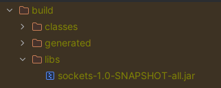

# Socket Plugin

## Development Commands
### Create ShadowJar
```./gradlew shadowJar ```

A file is then made in ```build/libs/```



### Run Executable Client
```java -jar -ea ./build/libs/{NAME_OF_JAR} ```
